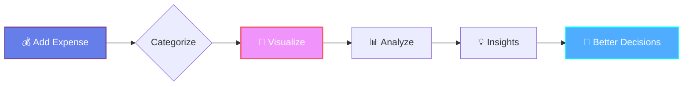

<div align="center">

# 💸 Apna Apna Dekh

### *Your Money, Your Vision, Your Control*


**A beautiful, lightning-fast expense tracking experience that transforms financial awareness into visual art.**

[✨ Live Demo](#) | [📖 Documentation](#) | [🚀 Quick Start](#-quick-start) | [🎯 Features](#-features)

---


</div>

---

## 🌟 Why Apna Apna Dekh?

> *"Track every rupee, visualize every trend, master every financial decision."*

In a world drowning in complex finance apps, **Apna Apna Dekh** stands apart:

- 🎨 **Visual Storytelling** – Your expenses become beautiful narratives through animated graphs
- ⚡ **Instant Clarity** – Real-time updates with buttery-smooth transitions
- 🔒 **Privacy First** – Everything stays in your browser. No sign-ups, no tracking, no cloud
- 🎯 **Zero Learning Curve** – Intuitive design that feels natural from first click
- 🌈 **Aesthetic Experience** – Financial tracking shouldn't be boring

---

## ✨ Features That Shine

<table>
<tr>
<td width="50%">

### 📊 **Intelligent Visualizations**
- Dynamic pie charts with hover animations
- Time-series line graphs for trend analysis
- Category breakdowns with color-coded clarity
- Smooth transitions & loading animations
- Interactive tooltips with detailed insights

</td>
<td width="50%">

### 🎨 **Design Excellence**
- Glassmorphic UI elements
- Glowing neon accents on interactions
- Micro-animations on every action
- Dark/Light theme toggle
- Gradient backgrounds that breathe

</td>
</tr>
<tr>
<td width="50%">

### 💎 **Smart Features**
- Autocomplete for common expenses
- Budget limit warnings with visual alerts
- Recurring expense templates
- Quick-add shortcuts (keyboard support)
- Export data as CSV/JSON

</td>
<td width="50%">

### 📱 **Mobile Mastery**
- Thumb-friendly interface
- Optimized for one-handed use
- Gesture controls (swipe to delete)
- Progressive Web App (PWA) ready
- Offline-first architecture

</td>
</tr>
</table>

---

## 🚀 Quick Start

```bash
# Clone the repository
git clone https://github.com/yourusername/apna-apna-dekh.git

# Navigate to directory
cd apna-apna-dekh

# Open in browser
open index.html

# Or serve locally
python -m http.server 8000
```

**That's it!** No dependencies, no build steps, no complications. Pure web magic. ✨

---

## 🎯 How It Works

<div align="center">



</div>

### **1️⃣ Input with Elegance**
Choose from **smart categories** with custom icons:
- 🍔 Food & Dining
- 🚗 Transportation
- 🏠 Bills & Utilities
- 🎮 Entertainment
- 🛒 Shopping
- 💊 Healthcare
- 📚 Education
- ✨ Custom Categories

### **2️⃣ Watch the Magic**
Your expense triggers:
- ✨ Smooth fade-in animation
- 📊 Real-time graph updates
- 🎯 Category percentage recalculation
- 🌈 Color-coded visual feedback

### **3️⃣ Gain Insights**
- **Weekly Overview**: Spot spending spikes instantly
- **Monthly Trends**: Identify patterns over time
- **Category Analysis**: See where money actually goes
- **Budget Alerts**: Get warnings before overspending

---

## 🛠️ Technology Stack

<div align="center">

| Technology | Purpose | Why We Chose It |
|:----------:|:-------:|:----------------|
|  | Structure | Semantic, accessible markup |
|  | Styling | Modern features: Grid, Flexbox, Animations |
|  | Logic | Vanilla JS for speed and simplicity |
|  | Graphs | Beautiful, responsive visualizations |

</div>

---

## 📱 Responsive Design Philosophy

### **Mobile First, Always**

```css
/* Our breakpoint strategy */
📱 Mobile:     0-640px   → Single column, large touch targets
💻 Tablet:   641-1024px  → Two columns, balanced layout
🖥️ Desktop: 1025px+      → Three columns, immersive graphs
```

#### **Adaptive Features:**
- ✅ Dynamic font scaling based on viewport
- ✅ Touch-optimized buttons (min 44×44px)
- ✅ Collapsible sections on small screens
- ✅ Gesture-based interactions
- ✅ Smart keyboard avoidance

---

## 🎨 Design Showcase

### **Color Palette**

<div align="center">

| Color | Hex | Usage |
|:-----:|:---:|:------|
| 🟣 Purple Gradient | `#667eea → #764ba2` | Primary actions, headers |
| 🔵 Blue Accent | `#4facfe → #00f2fe` | Success states, graphs |
| 🔴 Red Alert | `#f5576c → #f093fb` | Budget warnings |
| ⚪ Glassmorphic | `rgba(255,255,255,0.1)` | Cards, modals |

</div>

### **Animation Library**

```javascript
// Signature animations used throughout
✨ fadeInUp      // Entry animations
🌊 pulseGlow     // Button hovers
💫 shimmer       // Loading states
🎯 scaleIn       // Graph data points
🌈 gradientShift // Background ambiance
```

---

## 📊 Feature Deep Dive

### **Graph Types Available**

| Graph | Use Case | Interactivity |
|-------|----------|---------------|
| 🥧 **Pie Chart** | Category distribution | Hover for percentages, click to filter |
| 📈 **Line Graph** | Spending over time | Drag to zoom, click data points |
| 📊 **Bar Chart** | Category comparisons | Animated bars, sortable |
| 🔥 **Heatmap** | Daily spending intensity | Color intensity = amount |

### **Smart Analytics**

- 🧠 **AI-Powered Insights** *(Coming Soon)*: Predictive spending analysis
- 📉 **Anomaly Detection**: Flags unusual spending patterns
- 💰 **Budget Optimizer**: Suggests savings opportunities
- 🎯 **Goal Tracker**: Set and monitor financial targets

---

## 🔧 Customization

```javascript
// config.js - Personalize your experience
const userPreferences = {
  currency: '₹',           // Change currency symbol
  theme: 'dark',           // 'dark' | 'light' | 'auto'
  graphType: 'pie',        // Default visualization
  budgetLimit: 50000,      // Monthly budget in rupees
  categories: [...],       // Add custom categories
  animations: true         // Toggle animations
};
```

---

## 🚀 Roadmap

### **Version 2.1** (Next Month)
- [ ] 🌐 Multi-language support (Hindi, Tamil, Bengali)
- [ ] 📸 Receipt scanning with OCR
- [ ] 🔔 Push notifications for budget alerts
- [ ] 📤 Share expense reports

### **Version 3.0** (Q4 2025)
- [ ] 🤝 Split expenses with friends
- [ ] 💳 Bank integration (read-only)
- [ ] 🎯 AI spending advisor
- [ ] 🏆 Gamification & achievements

---

## 🤝 Contributing

We love contributions! Here's how you can help:

1. 🍴 Fork the repository
2. 🌿 Create a feature branch: `git checkout -b feature/amazing-feature`
3. 💻 Make your changes with clear commits
4. 🧪 Test thoroughly on multiple devices
5. 📤 Push and create a Pull Request

**Check out our** [Contributing Guidelines](CONTRIBUTING.md) **for detailed instructions.**

---

## 📄 License

This project is licensed under the **MIT License** – see [LICENSE](LICENSE) file for details.

**TL;DR**: You can use, modify, and distribute this freely. Just give credit! 🙏

---

## 🙏 Acknowledgments

Built with 💚 and countless cups of 🍵 chai

**Special Thanks To:**
- Chart.js team for incredible visualization tools
- The open-source community for inspiration
- Beta testers who provided invaluable feedback
- YOU for checking out this project! 🌟

---

<div align="center">

### **Made with 💜 in India**

**Star ⭐ this repo if it helped you track your expenses better!**

[⬆ Back to Top](#-apna-apna-dekh)

---

**Questions? Suggestions? Found a bug?**

[Open an Issue](https://github.com/yourusername/apna-apna-dekh/issues) | [Start a Discussion](https://github.com/yourusername/apna-apna-dekh/discussions)

</div>
